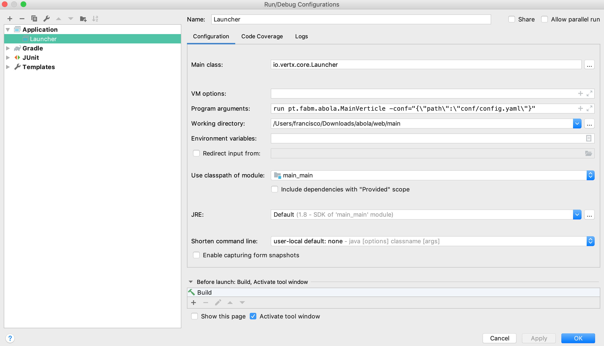

# frontend
Module made to run in the browser side with a couple of frontend tecnologies like webpack, typescript, react, redux etc...

The fastest way to see the changes that you do in typescript code is to run webpack:

    cd frontend
    ./node_modules/.bin/webpack-dev-server

The frontend module in ```/api``` path will forward de calls to http://localhost:8888 , for this reason you should start the main verticle

# main
Module, that has in it core a verticle to start the other verticles, to decouple the application as a whole.

Verticles that will be start:

- A rest verticle in module *rest*
- A dao verticle in module *memory-dao*

In the application all verticles have thier module and each module has only one verticle

This verticles comunicate to each other with the eventBus from vertx

The configuration file has the classes with the verticle implementation to make the replacement easy to do

``` yaml
verticles:
  dao: pt.fabm.abola.dao.MemoryDao
  rest: pt.fabm.abola.rest.RestVerticle
```
It's also necessary to pass in the config file the host and the port to publish the services

``` yaml
confs:
  rest:
    port: 8888
    host: localhost
```

To launch the application in one IDE like Intellij for instance we need to configurate the Launcher call

Example:


# rest
Module to publish the services, *dao* is called within, through the event bus calls

# dao
Module to persist or read de data needed in the other modules, this module has messsage consumers from event bus.

To pass messages with specific objects is required to construct an implementation of a MessageCodec. In the case that the sender and the receiver are in the same classloader we have amost none overhead, since the method that will be used is normally *transform*, the parameter might be the same has the returned

# shared
Module to create the models used in *rest* and *dao*, as well as the correspondent MessageCodec's

#### caveats
In intellij, the resources are not created in the build folder (normally is *out* directory) in contrast of what's happen in gradle, for that reason the gradle project have two taks to mitigate the problem.
  - copyIntellijMainRessources used to copy the main resources to *out* directory
  - copyIntellijTestRessources used to copy the test resources to *out* directory